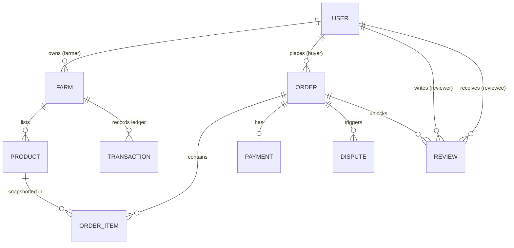

# System Specification Document
## Farmer to Buyer Direct Marketplace Platform

**Document Version:** 1.0.0  
**Date:** September 2026  
**Status:** Production / Final System Documentation  
**Repository:** [Farmer-to-Buyer Marketplace](https://github.com/Huxxyguy/farmer-to-buyer.git)

---

## 1. System Overview & Architectural Objectives

The **Farmer to Buyer Direct Marketplace** is a full-stack, decentralized agricultural e-commerce and financial escrow platform designed to connect rural and urban smallholder farmers in Nigeria directly with individual buyers, commercial aggregators, and institutions. 

By eliminating predatory middlemen, the platform empowers farmers with fair farm-gate pricing and grants buyers access to fresh produce filtered by geographic location (State, LGA/City) and produce category. The system integrates an **Escrow Payment Engine** powered by Paystack to hold buyer funds safely until produce delivery is confirmed, alongside a **Seller Bank Payout Engine** that allows farmers to withdraw released earnings directly to any commercial or digital bank in Nigeria.

### Key Operational Goals
1. **Direct Farm-Gate Marketplace**: Direct produce catalog with location-based discovery.
2. **Escrow Funds Safeguard**: Financial protection holding payments until buyer receipt confirmation or automatic 7-day release.
3. **Storefront KYC Verification**: Admin verification workflow before farm produce appears publicly.
4. **Historical Price Snapshotting**: Fixed purchase pricing frozen at checkout time to prevent retro-active price inflation.
5. **Verified Customer Reputation System**: Two-way star ratings and reviews locked exclusively to completed orders.
6. **Automated Seller Bank Withdrawals**: Real-time NUBAN bank payouts with an immutable financial transaction ledger.

---

## 2. High-Level System Architecture

The application follows a decoupled client-server architecture:

```
                  +-----------------------------------+
                  |         Next.js Web Client        |
                  |     (React / Vanilla CSS / UI)    |
                  +-----------------+-----------------+
                                    |
                                    | HTTP / REST API (JWT Auth)
                                    v
                  +-----------------+-----------------+
                  |      Fastify Node.js API Server   |
                  |   (Routes / Auth / Business Rules)|
                  +--------+----------------+---------+
                           |                |
             Prisma ORM    |                | External Webhook
                           v                v
                  +--------+-------+  +----+------------------+
                  | SQLite / Postgres |  |  Paystack Gateway     |
                  |  Database Engine  |  |  (Payment Verification)|
                  +----------------+  +-----------------------+
                           ^
                           | Background Job
                  +--------+------------------+
                  | 7-Day Auto-Release Cron   |
                  | Service Execution Daemon |
                  +---------------------------+
```

---

## 3. Technology Stack & Framework Selections

| Layer | Technology | Rationale & Selection Criteria |
| :--- | :--- | :--- |
| **Frontend Framework** | **Next.js 14+ (App Router)** | Client-side React rendering, dynamic routing (`/orders/[id]`), state management, fast page load performance. |
| **Frontend Styling** | **Vanilla CSS Design System** | Custom HSL color variables, Glassmorphism, CSS Grid/Flexbox layouts, responsive design tokens. |
| **Backend Runtime** | **Node.js (v18+)** | Asynchronous I/O, event-driven performance, seamless NPM package ecosystem. |
| **API Framework** | **Fastify** | High-performance, low-overhead HTTP web framework with built-in schema validation and plugin architecture. |
| **ORM / Database Layer** | **Prisma ORM** | Type-safe database queries, automated migration management, relational schema modeling. |
| **Database Engine** | **SQLite / PostgreSQL** | Lightweight local database for development, seamless transition to PostgreSQL for enterprise production. |
| **Authentication** | **Fastify JWT & bcrypt** | Stateless JSON Web Tokens (JWT) stored in HTTP cookies / local headers, salted password hashing. |
| **Payment & Escrow** | **Paystack API Integration** | Credit/Debit Card, USSD, and Bank Transfer payment gateway with HMAC SHA512 signature webhook handling. |
| **Scheduled Tasks** | **Node.js Cron Service** | Background execution daemon monitoring 7-day auto-release of unconfirmed escrow funds. |

---

## 4. Database Schema & Data Models

### Data Entity Relationship Diagram (ERD)



### Data Model Definitions

#### 1. User Model
* `id` (String, UUID, Primary Key)
* `email` (String, Unique)
* `password_hash` (String, Salted Hash)
* `name` (String)
* `phone` (String)
* `role` (Enum: `buyer`, `farmer`, `admin`)
* `verified` (Boolean, Default: false)
* `created_at` (DateTime)

#### 2. Farm Model
* `id` (String, UUID, Primary Key)
* `user_id` (String, Foreign Key -> User.id)
* `farm_name` (String)
* `state` (String)
* `city` (String)
* `address` (String)
* `verification_status` (Enum: `pending`, `verified`, `rejected`)
* `balance` (Float, Default: 0.0)
* `created_at` (DateTime)

#### 3. Product Model
* `id` (String, UUID, Primary Key)
* `farm_id` (String, Foreign Key -> Farm.id)
* `name` (String)
* `category` (String: Grains, Vegetables, Fruits, Tubers, Livestock)
* `price` (Float)
* `unit` (String: 50kg Bag, Basket, kg, Ton)
* `quantity_available` (Int)
* `photo_url` (String, Optional)
* `is_active` (Boolean, Default: true)

#### 4. Order Model
* `id` (String, UUID, Primary Key)
* `buyer_id` (String, Foreign Key -> User.id)
* `status` (Enum: `pending`, `paid`, `fulfilled`, `completed`, `disputed`, `cancelled`)
* `total_amount` (Float)
* `delivery_address` (String)
* `delivery_state` (String)
* `delivery_city` (String)
* `created_at` (DateTime)

#### 5. OrderItem Model (Historical Price Snapshotting)
* `id` (String, UUID, Primary Key)
* `order_id` (String, Foreign Key -> Order.id)
* `product_id` (String, Foreign Key -> Product.id)
* `quantity` (Int)
* `price_at_purchase` (Float) -- Snapshotted unit price

#### 6. Payment Model (Escrow Ledger)
* `id` (String, UUID, Primary Key)
* `order_id` (String, Foreign Key -> Order.id, Unique)
* `amount` (Float)
* `status` (Enum: `pending`, `held`, `released`, `refunded`)
* `gateway_reference` (String, Unique)
* `created_at` (DateTime)

#### 7. Transaction Model (Seller Bank Payout Ledger)
* `id` (String, UUID, Primary Key)
* `farm_id` (String, Foreign Key -> Farm.id)
* `amount` (Float)
* `type` (Enum: `credit`, `withdrawal`)
* `description` (String)
* `created_at` (DateTime)

#### 8. Review Model
* `id` (String, UUID, Primary Key)
* `order_id` (String, Foreign Key -> Order.id)
* `reviewer_id` (String, Foreign Key -> User.id)
* `reviewee_id` (String, Foreign Key -> User.id)
* `rating` (Int, 1-5 Stars)
* `comment` (String)
* `created_at` (DateTime)

#### 9. Dispute Model
* `id` (String, UUID, Primary Key)
* `order_id` (String, Foreign Key -> Order.id)
* `opened_by` (String, Foreign Key -> User.id)
* `reason` (String)
* `status` (Enum: `open`, `resolved_refund`, `resolved_release`)
* `admin_notes` (String, Optional)
* `created_at` (DateTime)

---

## 5. Backend API Endpoints Specification

### Authentication & User Account Routes (`/api/v1/auth`)
* `POST /register`: Account registration with role selection (`buyer` or `farmer`).
* `POST /login`: Authenticate credentials, generate JWT bearer token.
* `GET /me`: Fetch authenticated user profile and active session context.
* `POST /logout`: Invalidate session credentials.

### Farm Storefront Routes (`/api/v1/farms`)
* `POST /`: Register a farm profile (sets status to `pending` until admin approval).
* `GET /my-farm`: Fetch farmer's own storefront, listings, withdrawal balance, and transaction history.
* `GET /`: Query public list of verified farms (filterable by `state` and `city`).
* `GET /:id`: Fetch public details of a specific farm storefront.
* `POST /withdraw`: Initiate bank payout withdrawal from `farm.balance` to a NUBAN account.

### Produce Catalog Routes (`/api/v1/products`)
* `POST /`: Create produce listing (Farmer restricted).
* `GET /`: Search and filter marketplace produce catalog (Filters: `state`, `city`, `category`, `search`, `min_price`, `max_price`). Business Rule #2 enforced: Only active listings from verified farms with stock > 0 are returned.
* `GET /:id`: Fetch single produce item details.
* `PATCH /:id`: Update price, stock count, title, or category.
* `PATCH /:id/status`: Toggle listing active/inactive state.

### Sales Orders & Escrow Lifecycle Routes (`/api/v1/orders`)
* `POST /`: Create multi-item checkout order with pricing snapshot.
* `GET /my-orders`: Retrieve user's incoming/outgoing orders.
* `GET /:id`: Fetch detailed order breakdown, items, payment state, and dispute history.
* `POST /:id/pay`: Initialize Paystack checkout session or execute instant dev simulation (`mock: true`).
* `PATCH /:id/fulfill`: Mark order produce as dispatched/fulfilled by farmer.
* `POST /:id/confirm`: Buyer confirms receipt -> Releases escrow funds to `farm.balance` and updates status to `completed`.
* `POST /:id/dispute`: Buyer or Farmer opens arbitration dispute.

### Ratings & Reviews Routes (`/api/v1/reviews`)
* `POST /orders/:id/review` & `POST /reviews/orders/:id/review`: Submit star rating (1-5) and feedback for a completed order.
* `GET /farms/:id/reviews` & `GET /reviews/farms/:id/reviews`: Fetch farm reviews and calculate `average_rating` score.

### Admin Governance Routes (`/api/v1/admin`)
* `GET /farms/pending`: Fetch storefronts awaiting KYC verification.
* `POST /farms/:id/verify`: Approve or reject a farm storefront profile.
* `GET /disputes`: List open order disputes.
* `POST /disputes/:id/resolve`: Resolve dispute via `refund` to buyer or `release` to farmer.
* `PATCH /orders/:id/status`: Manual administrator override for order lifecycle state.
* `GET /analytics`: Fetch platform-wide metrics (total sales, escrow held, verified farms, user counts).

---

## 6. Business Logic Engine & Rules

### Core Business Rules
1. **Rule #1: Historical Price Snapshotting**: When an order is placed, `price_at_purchase` is snapshotted into `OrderItem`. Subsequent price edits by the farmer do not modify existing orders.
2. **Rule #2: Marketplace Public Visibility Scoping**: Produce items only appear in public marketplace search results if:
   - The farm storefront is `verified` by an Admin.
   - The product `is_active` boolean is `true`.
   - The `quantity_available` is greater than 0.
3. **Rule #3: Verified Order Review Locking**: Ratings and reviews can ONLY be posted for orders with status `completed`. Each participant is restricted to one review per order.
4. **Rule #4: Stock Decrement Timing**: Product stock is validated at order creation time, but only decremented upon successful payment confirmation.

### Order Lifecycle State Machine

```
   [ PENDING ]  --( Paystack / Mock Payment )-->  [ PAID (Escrow Held) ]
        |                                                     |
        +--( Cancelled )                               ( Farmer Dispatched )
                                                              v
   [ COMPLETED ] <--( Buyer Confirms Receipt )-- [ FULFILLED ]
        ^                                                     |
        | (Auto 7-day Cron Release)                           v
        +----------------------------------------- [ DISPUTED ] (Admin Arbitration)
```

---

## 7. Security Architecture & Quality Assurance

* **JWT Middleware**: Role-based access control (`requireRole(['buyer', 'farmer', 'admin'])`).
* **Password Hashing**: Cryptographic salted hashing via `bcrypt` preventing plain-text credential leaks.
* **Paystack Webhook Protection**: HMAC SHA512 signature validation matching `x-paystack-signature` header against `PAYSTACK_SECRET_KEY`.
* **Automated Test Coverage**: 49 passing end-to-end automated unit and integration tests across 5 development sprints (`npm test`).

---

## 8. Deployment Architecture

The application includes a `start.bat` launch script for dual-server orchestration:
* **Backend API**: Runs on Fastify (`http://localhost:5000`)
* **Frontend Web**: Runs on Next.js (`http://localhost:3000`)
