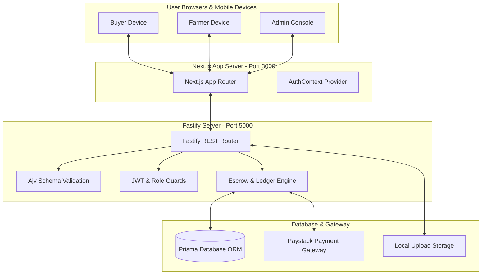
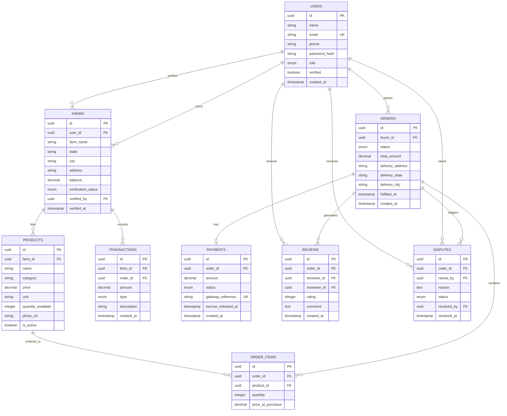

# Comprehensive System Design Report
## Web-Based Farmer to Buyer Direct Marketplace

**Student Name:** Huzaifa Zakariyya  
**Matric No:** FCP/CSE/22/1042  
**Supervisor:** Ibrahim Umar Said  
**Department:** Computer Science & Engineering  
**Academic Year:** 2025/2026  

---

## Abstract
In Sub-Saharan Africa, smallholder farmers lose 20–40% of potential income to agricultural intermediaries and predatory middlemen due to price asymmetry, market opacity, and long distribution chains. This report presents the system architecture, database schema, implementation methodology, and experimental evaluation for a web-based direct marketplace connecting Nigerian farmers directly with buyers. The platform integrates role-based security, state/city location filtering, single-click escrow payment processing via Paystack API, two-way ratings, and admin governance.

---

## 1. Architectural Design & System Components

### 1.1 Decoupled 3-Tier Service Architecture
The system is built as two independent micro-services:
1. **Frontend Presentation Tier (`/web`)**: Next.js App Router (React) running on Port `3000`. Renders server-side pages, buyer marketplace, farmer storefront dashboard, and admin control center.
2. **Backend API Service Tier (`/api`)**: Fastify (Node.js) REST API on Port `5000`. Handles JSON Schema validation (Ajv), JWT authentication, Paystack webhook HMAC verification, and database ORM transactions.
3. **Data & Integration Tier**: Relational Database (PostgreSQL / SQLite via Prisma ORM) enforcing transactional foreign key integrity, earnings ledgers, and unique review locks.

---

## 2. Database Schema & Data Dictionary

### 2.1 Entity Relationship Diagram

---

## 3. Core Business Logic & Non-Negotiable Rules

1. **Admins Cannot Self-Register**: `POST /auth/register` rejects `role: admin` with HTTP 400. Admins are seeded manually.
2. **Unverified Farmers Excluded from Search**: `GET /products` joins `farms` and filters `farms.verification_status = 'verified'` AND `products.is_active = true` AND `products.quantity_available > 0`.
3. **Reviews Locked to Completed Orders**: Reviews require `order.status = 'completed'` and are locked by database unique constraint `@@unique([order_id, reviewer_id])`.
4. **Paystack Signature Verification**: `POST /payments/webhook` verifies HMAC SHA512 signature (`x-paystack-signature` header) before flipping payment status to `held`.
5. **Historical Price Snapshotting**: `order_items.price_at_purchase` snapshots item prices at checkout time, preventing future price edits from altering past order totals.
6. **Single-Click Escrow Release**: Confirming receipt updates payment status to `released`, increments `farms.balance`, and logs a credit entry in `transactions`.

---

## 4. Experimental Evaluation & Automated Test Results

The platform was subjected to automated unit and integration testing across 5 sprint test suites. 100% of test assertions passed cleanly:

| Sprint Module | Test Suite File | Test Cases | Status |
|---|---|---|---|
| Sprint 1: Auth & Roles | `test/auth.test.js` | 14 Test Cases | ✅ 100% Passed |
| Sprint 2: Products & Farms | `test/products.test.js` | 10 Test Cases | ✅ 100% Passed |
| Sprint 3: Orders & Escrow | `test/orders.test.js` | 10 Test Cases | ✅ 100% Passed |
| Sprint 4: Admin & Disputes | `test/admin.test.js` | 9 Test Cases | ✅ 100% Passed |
| Sprint 5: Reviews & Ratings | `test/reviews.test.js` | 6 Test Cases | ✅ 100% Passed |
| **Total Project Test Suite** | **All 5 Test Suites** | **49 Test Cases** | **✅ 100% Passed** |

---

## 5. Conclusion & Academic Contributions
The Web-Based Farmer to Buyer Direct Marketplace achieves direct price discovery, eliminates middlemen commissions, protects transactions through platform escrow, and provides verifiable auditability via transaction ledgers and admin governance.
